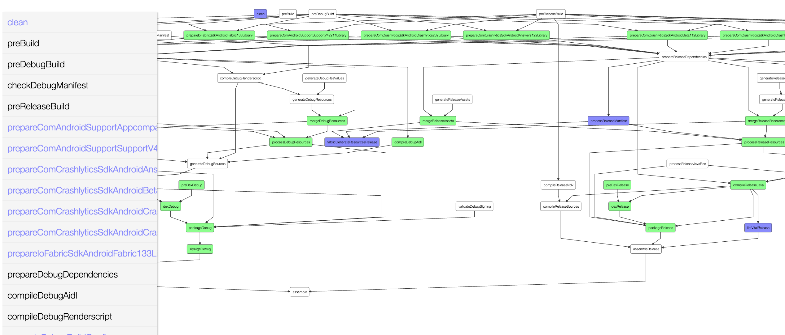
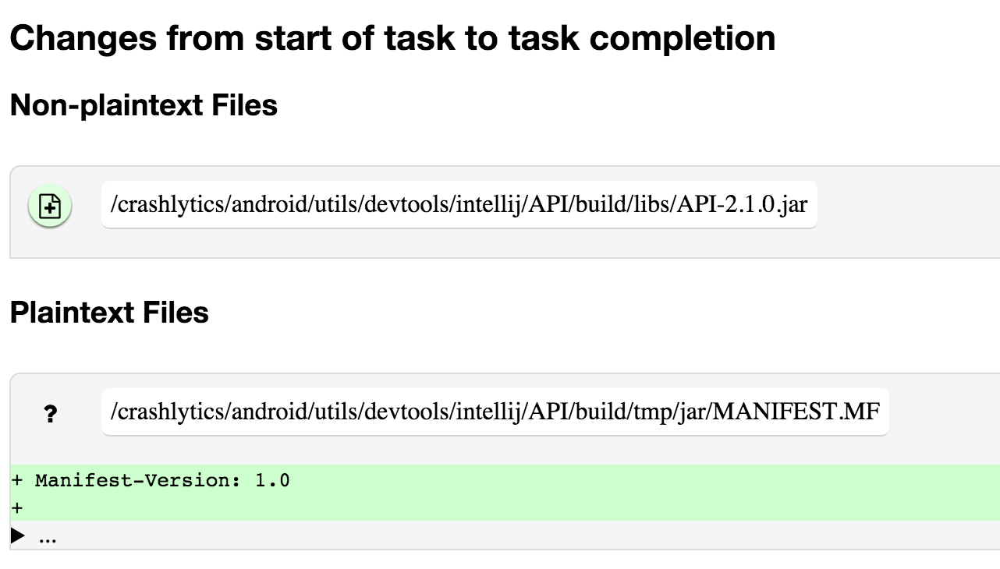
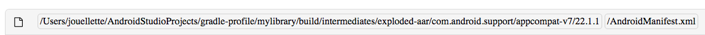

# Inspector

Gradle build inspector, clarifies what's going on inside your Gradle build. Features:

 - Makes it easy to understand your task dependencies by generating a task dependency graph.

 - Makes it easy to know what files have changed on disk by running diff (windows not supported)

 - *(incubating)* Compare the differences in file changes on disk between two builds by using -PcompareLastBuild

## Usage

Checkout and install locally:

    > ./gradlew install

Then, add the plugin and mavenLocal() to your build:

    buildscript {
        repositories {
            mavenLocal()
        }
        dependencies {
            classpath 'com.jakeout:gradle-inspector:+'
        }
    }

    allprojects {
        apply plugin: 'com.jakeout.gradle-inspector'
    }

## Features

Understanding Gradle Task graphs can be challenging. Gradle typically outputs a linear view of all of the tasks run during a build, with no sense of time or dependencies.

The Gradle build inspector elucidates the task graph by displaying it as a canvas directed-acyclic-graph using [d3](http://d3js.org/) as a rendering engine with [dagre](https://github.com/cpettitt/dagre-d3) as a layout manager.

Inspector generates a task graph for each app / library it is applied to, and will attempt to link them if you apply it to all projects in a hierarchy.

> 

Each task can be clicked and explored deeper. Tasks are colored "green" if they only have declared changes on disk. Tasks are colored blue if they have unexpected / undeclared side effects. A Gradle clean task deletes things, and therefore their removal is not explicitly declared as part of its output, though, most other gradle tasks are additive and so this can help identify missed side-effects.

Inspector is not intended to be a fast build tool. It shells out to the command line to run [diff](http://unixhelp.ed.ac.uk/CGI/man-cgi?diff) and outputs a `buildProfile` folder, caching the `build` folder after EVERY task runs. This means that it can be slow with large builds.

> 

The shell'd out Diff output is read using [Zutubi Diff](https://github.com/Zutubi/com.zutubi.diff), and 

Diff report features:

 - Diffs files -- A handful of lines of files are shown, the rest are hidden and can be expanded.

 - Diffs between two builds -- compare the differences (e.g., compare two Gradle builds, before and after Gradle is updated). Currently, only tasks for the second build are shown in the directed acyclic graph.

 - Show images / media content that change

 - Identify other running tasks and warns when diff may be inaccurate. Diff actions run at the start and end of each task, so if other tasks are running simultaneously, build behavior may produce strange outputs. (turning off parallel is recommended unless profiling this explicitly)

> 

Output rows have red icons of files with questions marks (provided by [Font awesome](https://github.com/FortAwesome/Font-Awesome) ) if they were not declared by the Gradle task. If the output was declared, but it was a folder, not a file, it has a subtle border splitting it from the child files that were modified within that declared folder.

## Optional Properties

*Run with -PpropertyName to enable*

 - __showInspection__: to auto-open the web URL.

- *(incubating)* __compareLastBuild__: Generates a report comparing this build's inputs and outputs against the last
build you made. These changes are written to the report page for each task (above the normal report.) This can be handy (e.g., if you're trying to figure out what is different about a new version of a Gradle plugin.) This feature is slower and more disk intensive, because of great caching and comparisons being made.